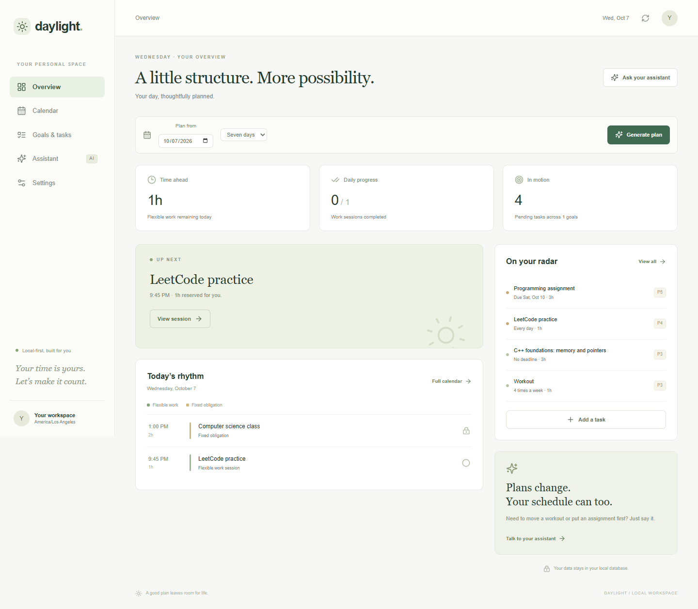
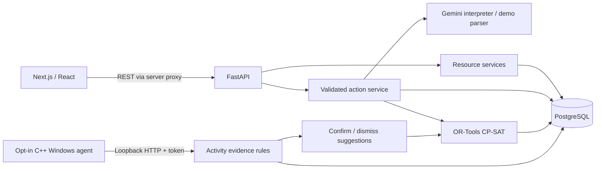

# Daylight — AI Life Assistant & Adaptive Scheduler

Daylight turns goals, deadlines and routines into workable plans, then helps you adjust when life changes. Gemini interprets requests into validated actions; a deterministic OR-Tools constraint model chooses actual session times. A native Windows companion can provide uncertain activity evidence for user-confirmed rescheduling.

A local-first, single-user portfolio project. No cloud hosting, queues or deployment infrastructure.



## Features

- Goal and task CRUD, priorities, deadlines, partial completion and daily/weekly routines.
- Day and week calendars, locked sessions, fixed recurring obligations and configurable sleep/availability.
- CP-SAT planning for 1–14 days, capacity explanations, recovery breaks and disruption penalties.
- Structured Gemini interpretation with Pydantic validation and transactional action batches.
- Clearly labeled deterministic demo parser with sample commands; no API key needed.
- Real conversational replanning, preserving completed, locked and in-progress blocks.
- Opt-in C++ Windows foreground-app/idle monitoring, bounded retry buffers and local HTTP reporting.
- Activity suggestions that the user can confirm or dismiss; activity never automatically completes or misses work.
- PostgreSQL persistence, Alembic migrations, API documentation, integration tests and CI.

## Stack

| Area | Technology |
| --- | --- |
| Web | Next.js 16 App Router, React 19, TypeScript, Tailwind CSS 4 |
| API | Python 3.12, FastAPI, Pydantic 2 |
| Persistence | PostgreSQL 17, SQLAlchemy 2, Alembic |
| Language interpretation | Google GenAI SDK, Gemini structured JSON output |
| Optimization | Google OR-Tools CP-SAT |
| Companion | C++17, Win32, WinHTTP, CMake |
| Tests | Pytest, Vitest, Testing Library, Playwright, CTest |
| Local infrastructure / CI | Docker Compose, GitHub Actions |

## Architecture



The backend is authoritative. Gemini has no database access, never selects calendar intervals, and cannot execute arbitrary tools or SQL. The action service resolves resource IDs, validates changes and executes a complete batch with schedule replacement in one transaction. An invalid later action or infeasible protected plan rolls back the entire batch.

PostgreSQL mutations lock the singleton preferences row with `SELECT FOR UPDATE`. Provider calls happen before acquiring that lock. UTC timestamps are stored and returned; an IANA timezone determines calendar days and local windows. SQLite is available for isolated tests and a standalone demo.

See [architecture](docs/ARCHITECTURE.md), [scheduler design](docs/SCHEDULER.md), [API reference](docs/API.md) and [validation status](docs/IMPLEMENTATION_STATUS.md).

## Local setup: Docker Compose

Requirements: Docker Desktop with Compose, Node.js 24 (22.12+ also meets the tooling minimum), npm. Python and a native compiler are optional when the API runs in Docker.

If the development preview is already running, stop it first with `.\scripts\stop-preview.ps1` to free ports 3000 and 8000. This preserves its database.

From the repository root, in PowerShell:

```powershell
Copy-Item .env.example .env
docker compose up --build -d
docker compose exec backend python -m app.seed

cd frontend
npm ci
npm run dev
```

Open **http://localhost:3000**. FastAPI documentation is at **http://localhost:8000/docs**. The backend container applies Alembic migrations before starting. The optional seed is idempotent and skips existing goals.

PostgreSQL data lives in a named Docker volume and survives container restarts. `docker compose down` stops services without deleting that volume. Frontend metrics derive from stored task/session data; seed data is explicitly sample data.

If you change the database password, update both `POSTGRES_PASSWORD` and the direct-run `DATABASE_URL` in `.env`. For Compose, use a URL-safe password because it is interpolated into a connection URL.

## Run FastAPI directly

Requirements: Python 3.11+ (3.12 tested). Start just PostgreSQL with `docker compose up -d db`, or supply a local PostgreSQL URL.

```powershell
# Repository root
python -m venv .venv
.\.venv\Scripts\python.exe -m pip install -r backend\requirements.lock
.\.venv\Scripts\python.exe -m pip install --no-deps -e backend

cd backend
..\.venv\Scripts\python.exe -m alembic upgrade head
..\.venv\Scripts\python.exe -m app.seed
..\.venv\Scripts\python.exe -m uvicorn app.main:app --host 127.0.0.1 --port 8000
```

In a second terminal:

```powershell
cd frontend
npm ci
npm run dev
```

On macOS/Linux use `.venv/bin/python` instead of `.venv\Scripts\python.exe`. The Windows companion requires Windows.

### Standalone demo without Docker

Change the backend database URL for that terminal only; this uses a persistent SQLite file:

```powershell
cd backend
$env:DATABASE_URL = "sqlite:///daylight.db"
$env:AI_MODE = "demo"
..\.venv\Scripts\python.exe -m alembic upgrade head
..\.venv\Scripts\python.exe -m app.seed
..\.venv\Scripts\python.exe -m uvicorn app.main:app --host 127.0.0.1 --port 8000
```

Run the frontend as above. PostgreSQL remains the intended runtime database and is separately exercised by the CI migration/persistence job.

## Gemini configuration

Set backend-only values in the root `.env`:

```dotenv
AI_MODE=gemini
GEMINI_API_KEY=your-key
GEMINI_MODEL=gemini-2.5-flash
```

Choose a structured-output-capable model available to your Google account. Restart FastAPI (or recreate the Compose backend) after changing environment variables. A missing key, provider failure or malformed response returns a clear error without applying changes. Keys are never returned by the API, passed to the web application or committed.

The integration uses the [Google structured output API](https://ai.google.dev/gemini-api/docs/structured-output) with the action JSON schema and independently validates the response. Live paid Gemini calls were not made during development; SDK calls, schemas and provider errors are tested with mocks.

### Demo commands

Demo mode is a limited deterministic parser, with its commands shown beside the chat. It does not pretend to understand arbitrary language.

```text
I want to get good at C++ by December.
I need to study LeetCode for an hour every day.
I have a programming assignment due Friday.
I have class Monday and Wednesday from 1 to 3.
I want to work out four times per week.
Move my workout to tonight.
I don't want to study C++ right now.
I finished LeetCode early.
I spent two hours gaming.
I need to finish this assignment first.
Reschedule my week.
```

Defaults are returned explicitly. Ambiguous references ask for clarification instead of guessing. The C++ learning goal creates two actionable initial work packages. If several C++ tasks exist, use the task form to select one; Gemini can resolve an exact title or ask a follow-up question.

## Windows companion

Install CMake and Visual Studio's **Desktop development with C++** workload, then:

```powershell
cmake -S desktop-agent -B desktop-agent/build -A x64
cmake --build desktop-agent/build --config Release
ctest --test-dir desktop-agent/build -C Release --output-on-failure
.\desktop-agent\build\Release\daylight-agent.exe --self-test
.\desktop-agent\build\Release\daylight-agent.exe --probe
```

To actually monitor:

1. Generate a random token with `python -c "import secrets; print(secrets.token_hex(32))"`.
2. Set the same `AGENT_TOKEN` in the backend `.env` and your companion terminal environment. Restart the backend.
3. Enable **Activity monitoring** in the web Settings.
4. Explicitly start the companion with `--enable`:

```powershell
$env:AGENT_TOKEN = "the-token-you-generated"
.\desktop-agent\build\Release\daylight-agent.exe --enable --backend http://127.0.0.1:8000
```

Press **Ctrl+C** to stop. Disabling monitoring in Settings rejects reports and stops sampling when the companion next reports. There is no startup registration or hidden always-on service.

It samples every five seconds and reports every 30 seconds by default. A bounded in-memory buffer survives short outages, with capped retry backoff; stopping discards unsent data. No screenshots, keylogging, window titles, browser history or file paths are collected. Only loopback HTTP destinations are permitted, redirects are disabled and a token is required.

Associate optional executable names (e.g. `Code.exe`) with a task in its editor. Matching apps are weak context, never proof of work. Unknown activity is not treated as unrelated. After at least 15 minutes of idle/unassociated evidence, an unresolved session can produce a suggestion. Confirmation replans unconfirmed work; dismissal keeps the plan. Credit actual work in the session dialog before confirming a suggestion if you already completed part of it.

See [agent design and validation](docs/DESKTOP_AGENT.md). The development machine lacked the MSVC workload; the executable was compiled and tested with Clang through a portable Zig C++ driver. The GitHub Windows job validates the normal MSVC build.

## API examples

```powershell
Invoke-RestMethod http://localhost:8000/api/tasks -Method Post -ContentType "application/json" -Body '{"title":"Review pointers","duration_minutes":60,"priority":4}'
Invoke-RestMethod http://localhost:8000/api/schedule/plan -Method Post -ContentType "application/json" -Body '{"days":7}'
Invoke-RestMethod http://localhost:8000/api/assistant -Method Post -ContentType "application/json" -Body '{"message":"I want to get good at C++ by December."}'
```

Use the returned task/session IDs to PATCH resources. Timestamps supplied to the API must have an explicit offset. All endpoints and schemas are documented at `/docs`; [API.md](docs/API.md) includes resource and error behavior.

## Tests and builds

```powershell
# Repository root; after backend dependencies are installed
.\.venv\Scripts\python.exe -m pytest backend\tests -q
.\.venv\Scripts\python.exe -m ruff check backend
.\.venv\Scripts\python.exe -m ruff format --check backend

cd frontend
npm ci
npm run typecheck
npm run lint
npm test
npm run build
npm audit --omit=dev
```

For real browser integration tests, run an API and frontend against an **isolated demo database**; the workflows create goals/tasks and complete a planned session:

```powershell
cd frontend
npx playwright install chromium
npm run test:e2e
# Or use an existing Chrome:
$env:CHROME_PATH = "C:\Program Files\Google\Chrome\Application\chrome.exe"
npm run test:e2e
```

To verify native HTTP ingestion without monitoring any real activity:

```powershell
.\.venv\Scripts\python.exe backend\scripts\agent_smoke.py desktop-agent\build\Release\daylight-agent.exe
```

This starts a temporary loopback backend/database and sends a synthetic unknown event. For a real PostgreSQL smoke test, migrate and seed a disposable PostgreSQL database, then run `python scripts/postgres_smoke.py` from `backend`.

CI runs backend tests, real PostgreSQL migrations and persistence, frontend checks/build, browser workflows and the Windows native build/CTest. Test results recorded in [IMPLEMENTATION_STATUS.md](docs/IMPLEMENTATION_STATUS.md) are local observations; CI itself has not been executed on GitHub yet.

## Screenshots

Captured from the launched application using actual persisted sample data, never fabricated:

- [Dashboard](docs/screenshots/dashboard.png)
- [Week calendar](docs/screenshots/calendar.png)
- [Mobile dashboard](docs/screenshots/mobile.png)

## Current limits and future work

- Single local user; no login, remote access, calendar sync or cloud deployment.
- Availability is one same-day window; obligations are weekly same-day intervals with optional date bounds.
- 15-minute flexible slots, 14-day horizon and 100 work-unit cap keep the optimization bounded. A feasible result within the eight-second solve budget is not always a proven optimum.
- Recurrences are calendar-day/week time budgets. Partial completions can produce smaller make-up sessions; minimum session limits still apply. Planning midweek tries to fit that week's remaining target.
- Historical unresolved sessions are not automatically marked missed. Resolve them explicitly or confirm activity suggestions.
- Task edits invalidate future movable reservations. Replanning penalties preserve other tasks where feasible. Timezone/preference changes can conflict with locked work; unlock or resolve it before replanning.
- Activity attribution remains uncertain and is sampled, not continuous. Reports older than 24 hours are rejected; events are retained for seven days.
- No live Gemini validation or sustained real-user monitoring was performed. Docker Compose execution awaits Docker on this development machine. Portable PostgreSQL, native compilation/HTTP ingestion and the real browser are validated locally.
- Five development-only audit findings remain in the current Next.js ESLint dependency chain (`braces`/`micromatch`/`fast-glob` and dependents). No compatible fixed release was available at validation time; production dependencies audit clean. The critical test-runner findings were removed by upgrading Vitest.
- Future improvements: richer availability, explicit recurrence occurrence IDs, better goal decomposition/dependencies, calendar import, accessibility review and provider contract tests.

No performance benchmarks are claimed. Credentials, databases, downloaded validation tools and build artifacts are ignored by Git.
