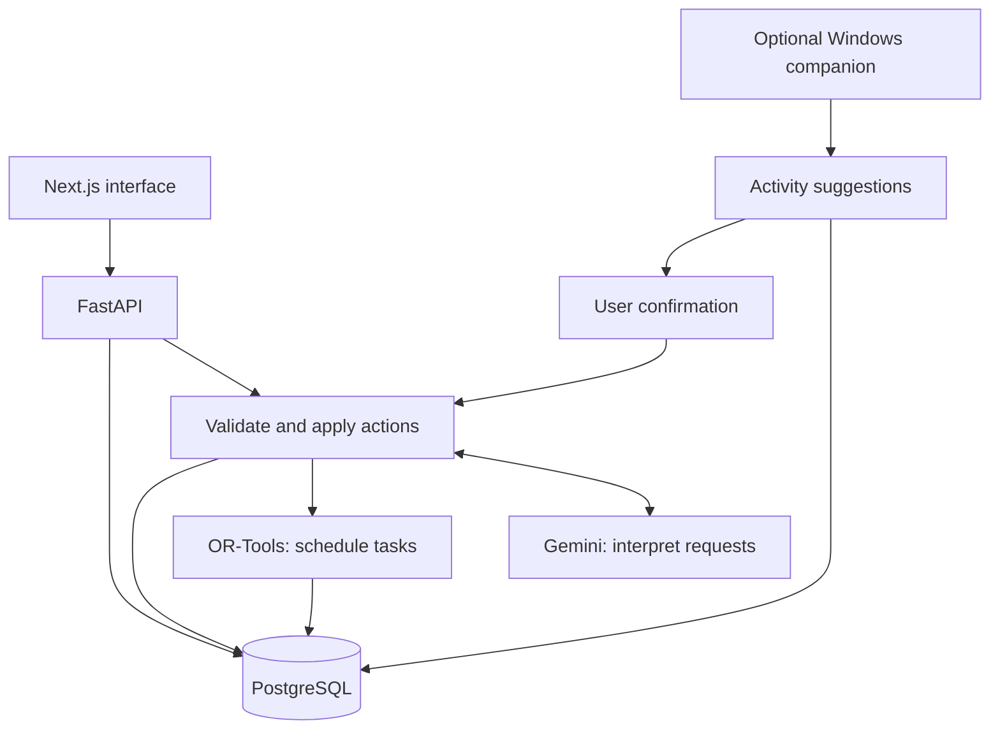

# AI Planner

Plan tasks, routines, and deadlines in one calendar. Generate a schedule with AI and adjust it as your plans change.


*This dark interface is implemented in [ai-scheduler](https://github.com/alex-rogo/ai-scheduler). It has not been ported to this repository, which currently uses a light interface.*

## Features

- Manage goals, tasks, deadlines, and recurring routines.
- Plan up to two weeks around fixed commitments and available time.
- Replan through chat while keeping completed and locked sessions.
- Track progress with day and week calendar views.
- Optionally use the Windows companion for activity-based suggestions.

## Run locally

Requires Docker Desktop and Node.js 24. Run these commands from the repository root in PowerShell:

```powershell
Copy-Item .env.example .env
docker compose up --build -d
docker compose exec backend python -m app.seed
cd frontend
npm ci
npm run dev
```

Open [localhost:3000](http://localhost:3000). The seed command adds sample data and is optional. Demo mode works without an API key and supports the sample commands shown in chat.

If a preview is already running, stop it with `.\scripts\stop-preview.ps1` first. Database data persists between container restarts.

### Enable Gemini

Set these backend values in the root `.env`:

```dotenv
AI_MODE=gemini
GEMINI_API_KEY=your-key
GEMINI_MODEL=gemini-2.5-flash
```

Then run `docker compose up -d --force-recreate backend`. Keep API keys out of Git.

## Architecture



Gemini interprets requests; OR-Tools chooses feasible times. FastAPI validates changes and saves them in PostgreSQL. Activity suggestions require your confirmation before replanning.

See [architecture details](docs/ARCHITECTURE.md).

## Limitations

- Built for one local user; no accounts, calendar sync, or cloud deployment.
- Plans use 15-minute slots with a maximum 14-day horizon.
- Demo chat accepts limited commands. Live Gemini behavior has not been validated against the provider.
- Activity signals are estimates and never automatically mark work complete.

## Documentation

- [Development and tests](docs/DEVELOPMENT.md)
- [Architecture](docs/ARCHITECTURE.md)
- [Scheduling rules](docs/SCHEDULER.md)
- [API reference](docs/API.md)
- [Windows companion](docs/DESKTOP_AGENT.md)
- [Validation status](docs/IMPLEMENTATION_STATUS.md)
