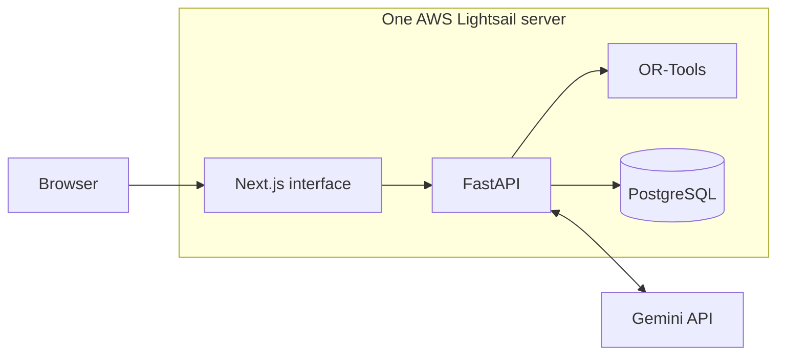

# Architecture

AI Planner is a single-user application. FastAPI owns the data and scheduling logic, while the Next.js interface displays it. Gemini turns chat requests into typed actions, and OR-Tools chooses feasible work times.

The online version runs everything on one small server. Caddy gives the server an HTTPS address and asks for the generated username and password before loading the app. PostgreSQL data stays on the server between app updates and restarts. A static IP keeps the web address stable.

The same frontend, backend, and database run locally through Docker Compose. The optional Windows companion remains local because it sends activity only to a loopback address.

UTC timestamps cross every boundary; IANA user timezones determine calendar days, sleep, and working windows. Fixed obligations can fall outside flexible-work availability. Completed, locked, and in-progress sessions are never moved by the solver. Historical missed or skipped intervals remain in the audit trail but do not block future work.

Mutating services serialize schedule changes through the preference row. Each action batch and schedule replacement commits together or rolls back. There are no queues or background workers: activity suggestions are evaluated when events arrive, and adaptation occurs only after user confirmation.
