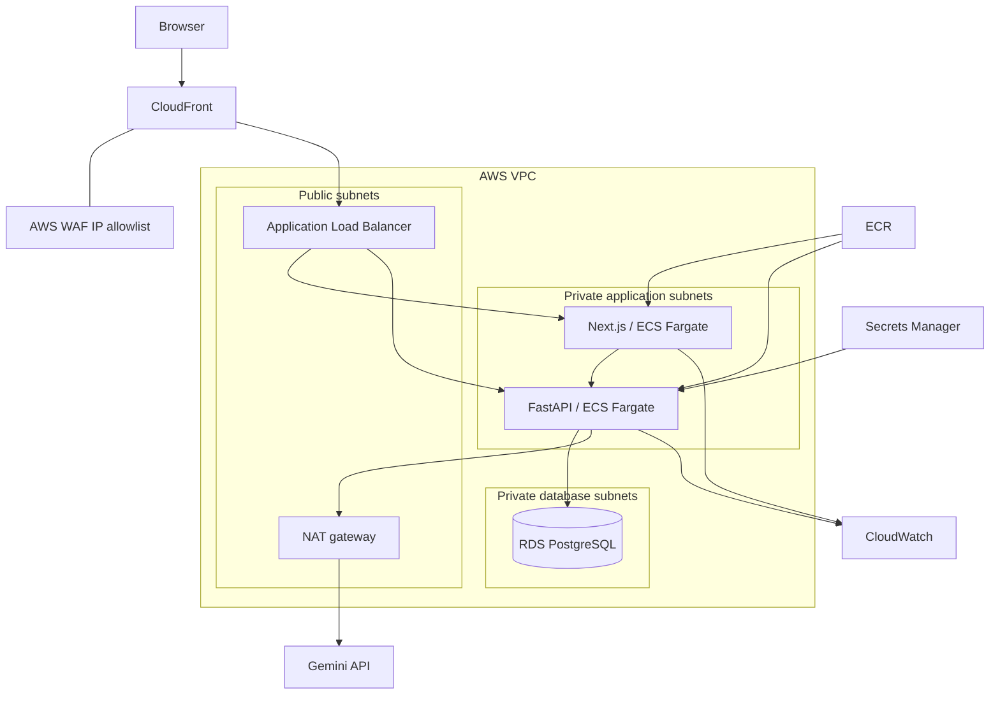

# Architecture

AI Planner is a single-user modular monolith. FastAPI owns application state and the Next.js interface renders its REST resources. Gemini proposes typed actions, the backend validates and applies them, and the OR-Tools CP-SAT solver chooses feasible work intervals.

CloudFront terminates viewer HTTPS. AWS WAF allows only configured IPv4 ranges because the application does not have user accounts. The load balancer accepts traffic only from the CloudFront origin-facing network and requires a generated origin header. It sends `/api/*` to FastAPI and other requests to Next.js. ECS tasks have no public IP addresses, and RDS accepts PostgreSQL traffic only from the backend security group.

The AWS stack uses two Availability Zones for the load balancer, ECS, and database subnet groups. One NAT gateway keeps the default deployment cost lower; enabling a NAT gateway per Availability Zone would improve egress resilience. RDS Multi-AZ is optional and disabled by default.

ECR stores the frontend and backend images. RDS manages its master password in Secrets Manager, and ECS injects it at startup. A separate Secrets Manager ARN can supply the Gemini key. Container logs and ECS Container Insights go to CloudWatch.

The same services run locally through Docker Compose. The C++ Windows companion submits coarse application and idle activity only after explicit opt-in. It uses a loopback connection and is intentionally outside the AWS deployment.

PostgreSQL is the normal runtime database. SQLite is supported for repeatable tests and an optional standalone demo. UTC timestamps cross every boundary; IANA user timezones determine calendar days, sleep and working windows. Fixed obligations can fall outside flexible-work availability. Completed, locked and in-progress sessions are never moved by the solver. Historical missed/skipped intervals remain in the audit trail but do not block future work.

Mutating services acquire the singleton preference row with SELECT FOR UPDATE on PostgreSQL, serializing schedule mutations across requests. All action batches and schedule replacement commit together or roll back. There are no queues or background workers: activity suggestions are evaluated when events arrive and adaptation occurs only after user confirmation.
